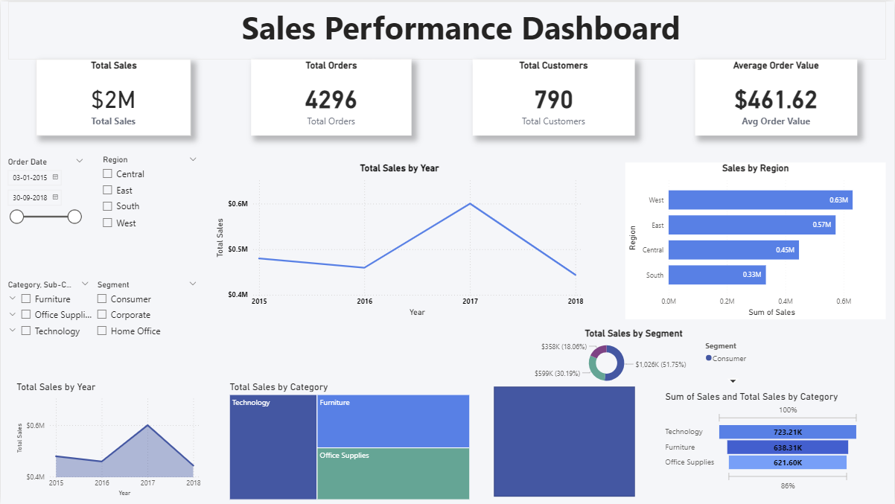
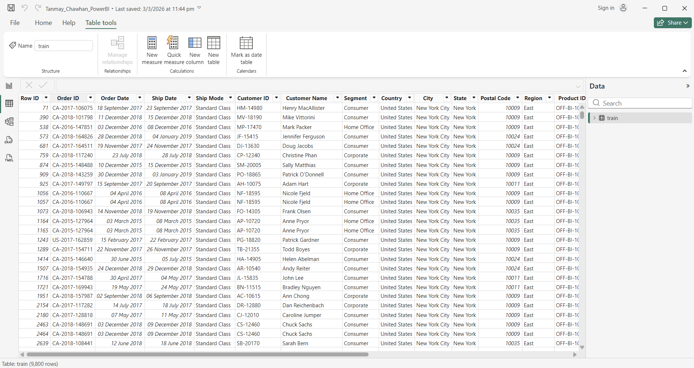

DAVIS Power BI – Module 2

This repository contains my completed Power BI dashboard project for Module 2 of the DAVIS Power BI course conducted by Anudip Foundation.

📊 Project Overview

This project demonstrates the creation of an interactive Sales Performance Dashboard using Microsoft Power BI.
The dashboard provides insights into sales performance, customer distribution, order trends, and regional sales analysis using visualizations and KPIs.

🧰 Tools & Skills Used

Microsoft Power BI

Data visualization

Data modeling

Dashboard design

Business insights generation

📈 Dashboard Features

Total Sales, Total Orders, Total Customers, and Average Order Value KPIs

Sales trend analysis by year

Regional sales comparison

Sales distribution by customer segment

Category-wise sales performance

Interactive filters for deeper analysis

📁 File Included

Tanmay_Chawhan_PowerBI.pbix – Power BI dashboard file

📷 Dashboard Preview

👨‍💻 Author

Tanmay Chawhan
Computer Engineering – Semester 8
